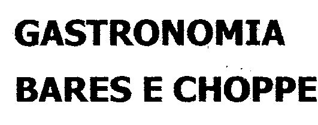

Title: Extraindo Texto de Imagens Com Python
Date: 2015-11-20 23:00
Tags: imagens,ocr,pytesseract,extrair texto
Category: Manipulação de imagens
Slug: extraindo-texto-de-imagens-com-python
Author: André Ramos
Email:  andrel.ramos97@gmail.com
Github: andrelramos
About_author: Programador web/desktop/mobile. Apaixonado por tecnologia, programação e python.

Introdução
-----------

Já precisou extrair texto de imagens mas não sabia como? aprenda como fazer isso com apenas 3 linhas de código (Por isso amo python!). Antes de começarmos, vamos ver um pouco de teoria.

### O que é OCR?

Segundo o Wikipedia, OCR é um acrónimo para o inglês Optical Character Recognition, é uma tecnologia para reconhecer caracteres a partir de um arquivo de imagem ou mapa de bits sejam eles escaneados, escritos a mão, datilografados ou impressos. Dessa forma, através do OCR é possível obter um arquivo de texto editável por um computador. Retirado de: [https://pt.wikipedia.org/wiki/Reconhecimento_%C3%B3tico_de_caracteres]

Como descrito acima, já existe uma tecnologia para realizar essa função, então apenas precisamos utilizá-la em nosso script python e assim desenvolvermos o que a imaginação permitir.

### Instalando Dependências (Ubuntu)

Primeiro vamos começar pela instalação do OCR e suas dependências. Abra o terminal e digite o seguinte comando:
	
	$ sudo apt-get install tesseract-ocr tesseract-ocr-por gscan2pdf imagemagick nautilus-open-terminal

Agora partiremos para a instalação do wrapper que irá permitir a utilização do OCR em nossos scripts:

	sudo pip install pytesseract

### Mão Na Massa!

Finalmente chegamos a parte prática desse artigo, como dito anteriormente são apenas 3 linhas simples de código, mas antes de começar baixe a seguinte imagem para realizar seus testes:

Agora vamos ao código:

	:::python
	
	from PIL import Image # Importando o módulo PIL para abrir a imagem no script
	
	import pytesseract # Módulo para a utilização da tecnologia OCR

	print( pytesseract.image_to_string( Image.open('nome_da_imagem.jpg') ) ) # Extraindo o texto da imagem

Simples né? Mas nem sempre o texto sai 100% correto, depende muito da qualidade da imagem e da quantidade de detalhes que a mesma possui, porem existe algumas técnicas usadas para fazer melhorias na imagem diminuindo a chance de erros na hora da extração.

Por hoje é só, boa programação gelera =D
